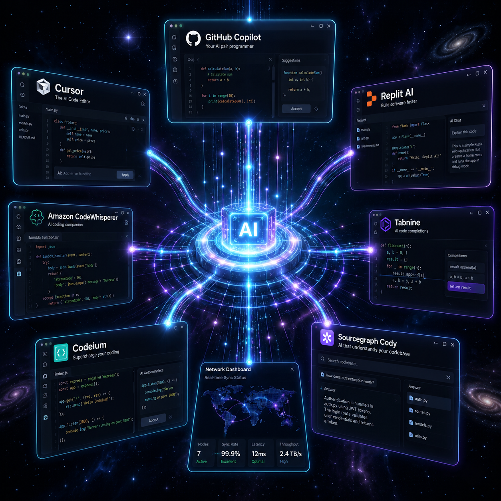
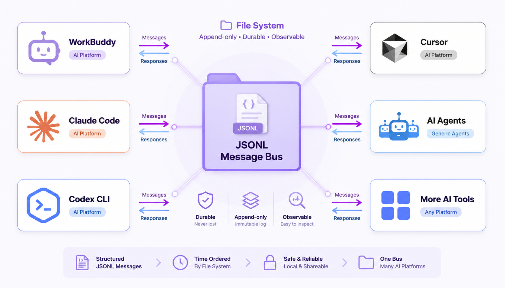
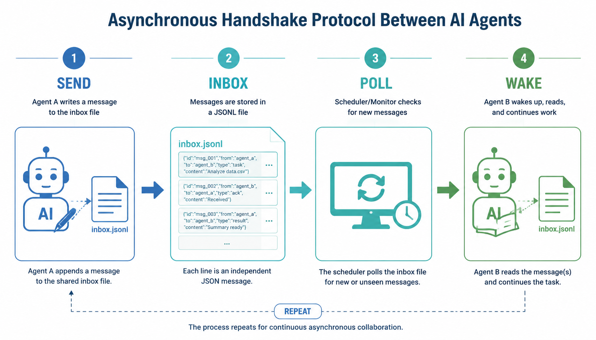
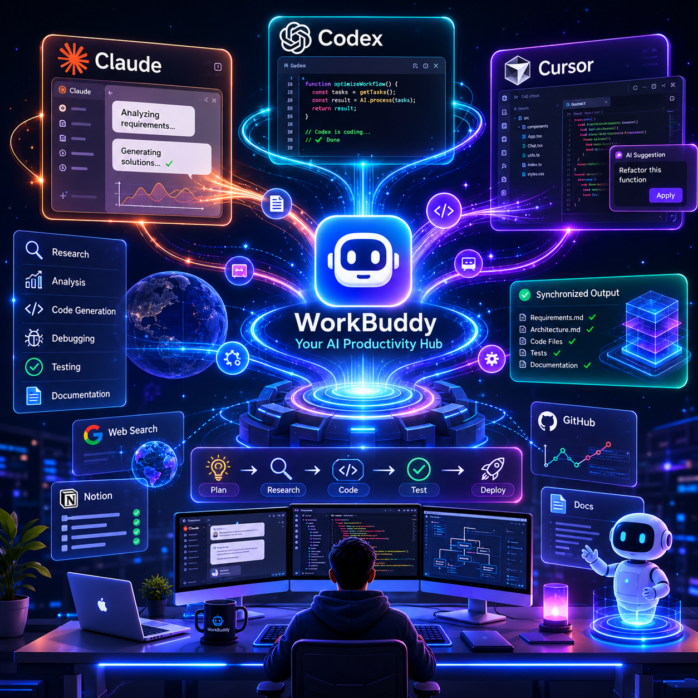

# 巴别塔协议：让跨平台 AI 智能体说同一种话

> **Babel Tower —— 基于文件系统的跨平台 Agent 通讯协议**
>
> 一个下午就能跑通的零依赖方案，让 WorkBuddy、Claude Code、Codex CLI、Cursor 任意组合协同工作。

---

## 引言：当 Agent 们各说各话

想象这样一个场景。

你正在用 WorkBuddy 管理一个全栈项目。达芬奇🎨（前端）刚画完 UI 原型，你需要把它交给鲁班💻（后端）开始写 API。但问题是——达芬奇是 WorkBuddy 的 Agent，而鲁班在 Cursor 里干活。两者之间没有桥梁。你把达芬奇输出的设计稿复制粘贴到一个临时文件里，再手动告诉鲁班："从这里开始。"

十分钟后，鲁班完成了 API，需要交给探照灯🔍（QA）写测试用例。探照灯在 Codex CLI 里运行。同样的复制粘贴，同样的上下文丢失，同样的手动同步。

这不是未来。这是现在每个多平台 AI 使用者每天都在重复的故事。

Agent 越来越聪明，但它们之间的"语言壁垒"越来越高。每个平台都在建造自己的高塔，塔与塔之间没有路。

这就是**巴别塔困境**。



---

## 核心洞察：回到最小公分母

解决跨平台通讯的方法很多。我们来看看常见的选择：

| 方案 | 依赖 | 问题 |
|------|------|------|
| HTTP API | 网络、服务发现 | 需要常驻服务，配置复杂 |
| WebSocket | 长连接、协议栈 | 跨平台支持参差不齐 |
| Message Queue | 中间件（Redis/RabbitMQ） | 引入外部系统，部署变重 |
| **文件系统** | **无** | **任何 Agent 都能读写** |

我们想要的不是最优雅的方案，而是**最普适的方案**。

文件系统有一个不可替代的特性：**它是所有 Agent 的共同交集**。无论你在 WorkBuddy、Claude Code、Codex CLI 还是 Cursor 里工作，你都能 `open()` 和 `write()`。不需要 SDK，不需要驱动，不需要网络。

巴别塔协议选择 JSONL 文件作为消息总线。原因只有一个：**如果 Agent 能执行代码，它就能读写文件**。

---

## 架构：两层 inbox 的设计哲学

巴别塔的架构设计受到 Unix 哲学的启发：做一件事，做好一件事。

```
workspace/
├── babel-tower/                    # 协议根（模板+协议+脚本）
│   ├── scripts/                    # babel-init / send / check / summary
│   ├── protocols/                  # message-schema.json
│   └── templates/                  # manifest.yaml
│
└── tasks/active/TASK-xxx/
    └── babel-tower/                # 任务级实例（运行时生成）
        ├── manifest.yaml           # 团队成员注册表
        ├── inbox/{agent}.jsonl     # 各成员收件箱
        └── .state.json             # 读取状态追踪
```

### 为什么是两层？

**Task-scoped inbox**：每个任务独立，上下文完全隔离。前端重构任务的消息不会污染后端 API 任务的收件箱。当任务完成归档时，整个通讯记录随之归档，历史可追溯。

**Global inbox**：跨任务广播，用于会话级调度。比如系统通知、紧急阻塞、或者调度者想广播一条"所有 Agent 检查收件箱"的消息。

这种分层设计的妙处在于——它模仿了人类团队协作的自然模式：项目群里聊项目，大群里发通知。



---

## 消息协议：人类可读的 JSONL

### 一条消息长什么样

```json
{
  "id": "msg_20260612_173200_a1b2c3",
  "from": "backend-dev",
  "to": "frontend-dev",
  "type": "handoff",
  "priority": "P1",
  "subject": "API module complete",
  "body": "POST /auth/login is ready with tests. See deliverables/auth-api-spec.yaml",
  "task_id": "TASK-20260612-001",
  "artifacts": ["deliverables/auth-api-spec.yaml"],
  "created_at": "2026-06-12T17:32:00+08:00"
}
```

JSONL 意味着每条消息独占一行，用 `cat` 就能直接看，用 `grep` 就能搜索，用 `tail -f` 就能实时追踪。不需要专用客户端，不需要解析器。

### 12 种消息类型

| 类型 | 用途 |
|------|------|
| `task_assign` | 分配子任务 |
| `task_report` | 汇报进度/结果 |
| `handoff` | 工作交接（A 完成 → B 继续）|
| `query` | 查询/询问 |
| `block` | 阻塞（等待外部输入）|
| `unblock` | 解除阻塞 |
| `ack` | 确认收到 |
| `broadcast` | 广播通知 |
| `close` | 关闭任务 |
| `plan_req` | 请求制定计划 |
| `plan_resp` | 返回计划 |
| `summary` | 生成会话摘要 |

`handoff` 是最核心的类型——它代表一段工作的完整交接。从谁手里来，到谁手里去，带了什么产出，有什么需要注意的，一条消息说清楚。

---

## 握手协议：异步协作的艺术

巴别塔不是实时通讯，而是**异步持久化协作**。消息写入文件后一直存在，接收方按需读取。

这里有一个关键洞察：**Agent 的工作天然是异步的**。达芬奇画 UI 可能需要 10 分钟，鲁班写 API 可能需要半小时。它们不需要实时对话，只需要可靠的交接机制。

### 四步握手流程

想象这样一个协作场景：

> 鲁班💻（后端 Agent）完成了用户认证模块。他需要把结果交给前端 Agent 达芬奇🎨继续。

**第一步：鲁班发送交接消息**

```bash
python babel-tower/scripts/babel-send.py \
  --task TASK-20260612-001 \
  --to frontend --type handoff \
  --subject "Auth API ready" \
  --body "POST /auth/login implemented with JWT. Spec in deliverables/auth-api.yaml"
```

消息被追加到达芬奇的 `inbox/frontend.jsonl` 文件中。

**第二步：消息持久化**

JSONL 文件现在多了一行。即使达芬奇此刻不在线，消息也不会丢失。它就在那里，等着被读取。

**第三步：调度者轮询**

调度者（通常是用户或主控 Agent）每轮对话开始时运行：

```bash
python babel-tower/scripts/babel-check.py \
  --task TASK-20260612-001 --all --unread
```

输出显示："frontend 有 1 条未读消息，来自 backend，类型 handoff"。

**第四步：唤醒达芬奇**

调度者通知达芬奇检查收件箱。达芬奇读取 JSONL，获取完整上下文——鲁班的产出、相关文件路径、注意事项——然后继续前端集成工作。

整个流程不需要 daemon、不需要 cron、不需要 WebSocket 长连接。调度者每轮对话开始时顺手检查一下 inbox，异步协作就自然发生了。



---

## 快速开始：一个下午跑通

### 1. 初始化任务通讯

为团队注册成员和收件箱：

```bash
python babel-tower/scripts/babel-init.py \
  --task TASK-20260612-001 \
  --members "orchestrator,frontend,backend" \
  --task-name "Auth refactor"
```

这会为每个成员创建一个空的 JSONL 收件箱。

### 2. 发送消息

任务内交接：

```bash
python babel-tower/scripts/babel-send.py \
  --task TASK-20260612-001 \
  --to frontend --type handoff \
  --subject "API ready" --body "Start UI integration"
```

全局通知：

```bash
python babel-tower/scripts/babel-send.py \
  --global --to orchestrator \
  --type query --subject "DB migration status"
```

### 3. 检查收件箱

```bash
# 查看任务内未读消息
python babel-tower/scripts/babel-check.py \
  --task TASK-20260612-001 --all --unread

# 查看全局通知
python babel-tower/scripts/babel-check.py --global --all --unread
```

### 4. 生成会话摘要

```bash
python babel-tower/scripts/babel-summary.py --task TASK-20260612-001
```

自动生成对话摘要，写入摘要文件，便于后续回顾和上下文恢复。

---

## 跨平台集成：真正的 Universal

巴别塔不绑定任何框架。接入方式简单到可笑：

| 平台 | 接入方式 |
|------|---------|
| **WorkBuddy** | 加载 `babel-tower` Skill |
| **Claude Code** | 直接读写 inbox 文件 |
| **Codex CLI** | 通过 Python 脚本调用 |
| **Cursor** | 子 Agent 读取 JSONL |
| **任意工具** | `open()` + `write()` |

这就是"最小公分母"的威力。不需要为每个平台写适配器，不需要处理协议差异。只要能操作文件，就能加入巴别塔网络。



---

## 与 GEM 架构的融合

巴别塔不是独立系统，而是 GEM 架构的**第 16 号基因（Gene 16: BabelComm）**。

```
Gene 13 (DevTeamAssemble) 触发团队组建
        ↓
自动初始化 babel-tower（任务级 inbox）
        ↓
Gene 16 (BabelComm) 激活通讯协议
        ↓
成员通过 inbox 异步协作
```

当 SOUL.md 注入 Gene 16 后，每个 Agent 在会话启动时自动检查 inbox。这意味着："上线即同步"——Agent 一醒来就知道有没有新任务、有没有交接消息、有没有紧急通知。

巴别塔从外部工具变成了 Agent 的**内置通讯本能**。

---

## 为什么不是 HTTP？不是 WebSocket？

这个问题经常被问到。让我们诚实对比：

| 维度 | HTTP API | WebSocket | 巴别塔（文件系统）|
|------|---------|-----------|------------------|
| 依赖 | 需要服务 | 需要服务+长连接 | 零依赖 |
| 持久化 | 需数据库 | 内存易失 | 文件即日志 |
| 人类可读 | 需工具 | 需工具 | `cat` 直接看 |
| 跨平台 | 需 SDK | 需 SDK | 只要有文件系统 |
| 调试 | 抓包/日志 | 抓帧 | 直接打开 JSONL |
| 延迟 | 毫秒级 | 毫秒级 | 秒级（轮询）|

**trade-off 很明确**：我们牺牲实时性，换取普适性和零依赖。

但等等——Agent 任务的粒度通常是分钟级。前端写页面要 10 分钟，后端调 API 要 20 分钟，QA 写测试要 15 分钟。3-5 秒的轮询延迟在分钟级的工作流中完全可以忽略。

我们不需要毫秒级的实时通讯。我们需要的是**可靠的交接**。

---

## 源码与协议

- **协议规范**：`protocols/message-schema.json`
- **核心脚本**：4 个 Python 文件，共 ~400 行，零第三方依赖
- **模板**：`templates/manifest.yaml`
- **License**：MIT

```bash
git clone https://github.com/jafferchong/babel-tower-protocol.git
```

---

## 结语：这一次，所有人说同一种话

古老的巴别塔传说中，人类因为语言不通而无法建成通天塔。

今天的 AI 世界也在建造各自的高塔——WorkBuddy 的高塔、Claude 的高塔、Cursor 的高塔。每个塔都很宏伟，但塔与塔之间没有路。

巴别塔协议想做的很简单：**给这些高塔之间铺一条路**。

不是最华丽的路，不是最快的路，而是**任何人都能走的路**。用文件系统做消息总线，用 JSONL 做通用语，用 inbox 做邮局。

当一个 WorkBuddy Agent 完成前端代码，一条 `handoff` 消息写入文件，Cursor 里的 Agent 读取后继续工作——没有复制粘贴，没有上下文丢失，没有平台壁垒。

这就是巴别塔的愿景：**让 Agent 协作像发邮件一样简单**。

---

*Built for cross-platform agent collaboration. Inspired by the original Tower of Babel — this time, everyone speaks the same language.*
